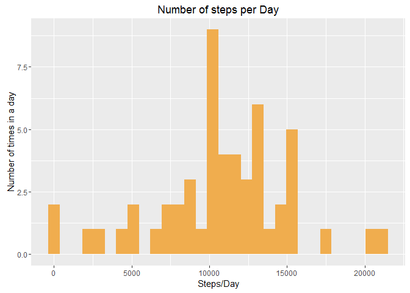
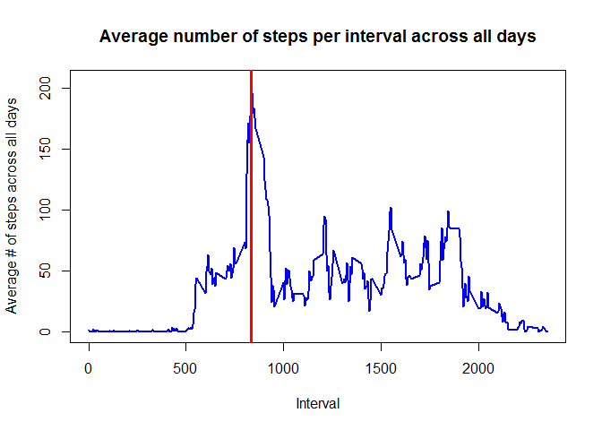
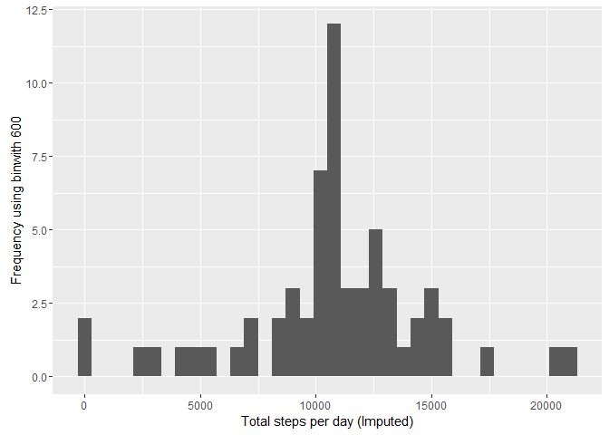
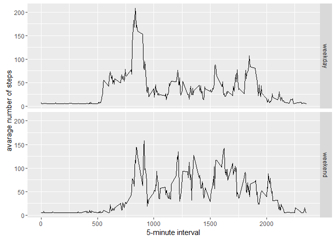

# Reproducible Research: Peer Assessment 1


```r
library(ggplot2)
library(scales)
library(Hmisc)
```

```
## Warning: package 'Hmisc' was built under R version 3.3.1
```

```
## Loading required package: lattice
```

```
## Loading required package: survival
```

```
## Loading required package: Formula
```

```
## 
## Attaching package: 'Hmisc'
```

```
## The following objects are masked from 'package:base':
## 
##     format.pval, round.POSIXt, trunc.POSIXt, units
```

## Loading and preprocessing the data

1.  Load data

```r
data <- read.csv('activity.csv')
dim(data)
```

```
## [1] 17568     3
```
2.  Preprocessing data

```r
#Remove NAs
processData = data[!is.na(data$steps), ]  
dim(processData)
```

```
## [1] 15264     3
```

```r
# Keep a list of all possible days
uniqueDates <- unique(processData$date)

# Keep a list of all possible intervals
uniqueIntervals <- unique(processData$interval)
```


## What is mean total number of steps taken per day?

1.  Total number of steps taken per day

```r
    NbrStepsDate <- aggregate(processData$steps, list(processData$date), sum)
    colnames(NbrStepsDate) <- c("date", "steps")
    
    Smean   <- mean(NbrStepsDate$steps)
    Smedian <- median(NbrStepsDate$steps)
    
    # Steps mean
    Smean
```

```
## [1] 10766.19
```

```r
    # Steps median
    Smedian
```

```
## [1] 10765
```

2.  Histogram of the total number of steps taken each day.


```r
library(ggplot2)

ggplot(data=NbrStepsDate, aes(x=steps)) +
  geom_histogram(fill="#f0ad4e") +  
  ggtitle("Number of steps per Day") +
  labs(x="Steps/Day", y="Number of times in a day")
```

```
## `stat_bin()` using `bins = 30`. Pick better value with `binwidth`.
```

<!-- -->

## What is the average daily activity pattern?

1.  Time series plot of the average number of steps taken


```r
    # Split the data according to the interval
intSplit <- split(processData$steps, processData$interval)

# Find the average amount of steps per time interval - ignore NA values
AVGStepsPerInt <- sapply(intSplit, mean, na.rm=TRUE)

# Plot the time-series graph
plot(uniqueIntervals, AVGStepsPerInt, type="l",
     main="Average number of steps per interval across all days", 
     xlab="Interval", ylab="Average # of steps across all days", 
     lwd=2, col="blue")

# Find the location of where the maximum is
maxIntervalDays <- max(AVGStepsPerInt, na.rm=TRUE)
maxIndex <- as.numeric(which(AVGStepsPerInt == maxIntervalDays))

# Plot a vertical line where the max is
maxInterval <- uniqueIntervals[maxIndex]
abline(v=maxInterval, col="red", lwd=3)
```

<!-- -->


## Imputing missing values

### Devise a strategy for filling in all of the missing values in the dataset

1.  Create a new dataset that is equal to the original dataset but with the missing data filled in.

```r
DataImputed <- data
DataImputed$steps <- impute(data$steps, fun=mean)
```
2.  Make a histogram of the total number of steps taken each day

```r
stepsByDayImputed <- tapply(DataImputed$steps, DataImputed$date, sum)
qplot(stepsByDayImputed, xlab='Total steps per day (Imputed)', ylab='Frequency using binwith 600', binwidth=600)
```

<!-- -->

3.  Calculate and report the mean and median total number of steps taken per day.


```r
print(paste("Mean:  ", mean(stepsByDayImputed)))
```

```
## [1] "Mean:   10766.1886792453"
```

```r
print(paste("Median: ", median(stepsByDayImputed)))
```

```
## [1] "Median:  10766.1886792453"
```

4.  Create a new factor variable in the dataset with two levels - "weekday" and "weekend" indicating whether a given date is a weekday or weekend day.


```r
DataImputed$dateType <-  ifelse(as.POSIXlt(DataImputed$date)$wday %in% c(0,6), 'weekend', 'weekday')
```

## Are there differences in activity patterns between weekdays and weekends?


```r
averagedDataImputed <- aggregate(steps ~ interval + dateType, data=DataImputed, mean)
ggplot(averagedDataImputed, aes(interval, steps)) + 
    geom_line() + 
    facet_grid(dateType ~ .) +
    xlab("5-minute interval") + 
    ylab("avarage number of steps")
```

<!-- -->
